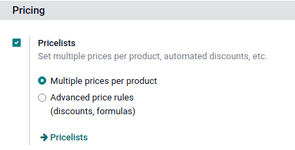
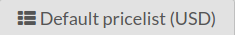

==========
Pricelists
==========

The pricelist feature in Point of Sale allows you to adjust product prices based on predefined
criteria. This feature can be employed for a designated duration, like a temporary sale on products
within a particular PoS category, for specific users, and more. Additionally, it can also be
required to meet certain conditions, such as a minimum purchase quantity or amount.

Set up pricelists
=================

To set up a pricelist, the feature must be activated in the Point of Sale app's settings. To do so,
reach the general PoS app's settings and enable :guilabel:`Pricelists` in the :guilabel:`Pricing`
section.

.. note::
   The feature can be already available in Point of Sale if it was already enabled in the
   :doc:`Sales <../../sales/products_prices/prices/pricing>` app or the :ref:`Website
   <multi_website/pricelists>` app.

Then, select the type of pricelist by selecting either :guilabel:`Multiple prices per product` or
:guilabel:`Advanced price rules (discounts, formulas)` and click :guilabel:`Pricelists` to create
new ones, or modify existing ones.

.. note::
   Alternatively, you can go to :menuselection:`Point of Sales --> Products --> Pricelists` to reach
   the previous screen.

Create pricelists
=================

Click :guilabel:`Create` or select an existing pricelist. The pricelist setup form differs depending
on the selected type of pricelist.

.. tabs::
   .. tab:: Multiple prices per product

      This type of pricelist requires to select a product for which you can attribute one or
      multiple other prices. To do so, click :guilabel:`Add a line`, select a product, and add
      optional conditions such as a specific quantity to reach for the price to change in the
      :guilabel:`Min. Quantity` column or a specific period of time during which the pricelist can
      be applied in the :guilabel:`Start Date` and :guilabel:`End Date` columns. Additionnally, you
      can filter the pricelist to be set on one specific variant of the selected product in the
      :guilabel:`Variants` column.

      .. note::
         - You can leave the conditional column empty to use this pricelist without condition.
         - If the conditions are not met, the pricelist can be selected but the discount will not be
           applied.

      .. image:: pricelists/multiple_prices.png
         :alt: setup form of a pricelist. Here, the price of the product changes w

   .. tab:: Advanced price rules

      .. image:: pricelists/price_rules.png
         :alt: setup form to configure an advanced pricelist

Once pricelists are created, go to the POS' settings and select either one pricelist in the
:guilabel:`Default Pricelist`field, or tick the :guilabel:`Advanced Pricelists` checkbox and fill in
the :guilabel:`Available` field with all the desired pricelists.

.. note::
   All available pricelists must be in the same currency as the company or as the **Sales Journal**
   set on the selected point of sale.

Use pricelists
==============

Open a POS session and manually click the **pricelists** button, then select the desired pricelist
from the list.

You can also set a pricelist to be selected automatically once a specific customer is set. To do so,
go to the customer form and select a pricelist on the :guilabel:`Pricelist` field of the
:guilabel:`Sales & Purchase` tab.

.. seealso::
   :doc:`../../sales/products_prices/prices/pricing`
